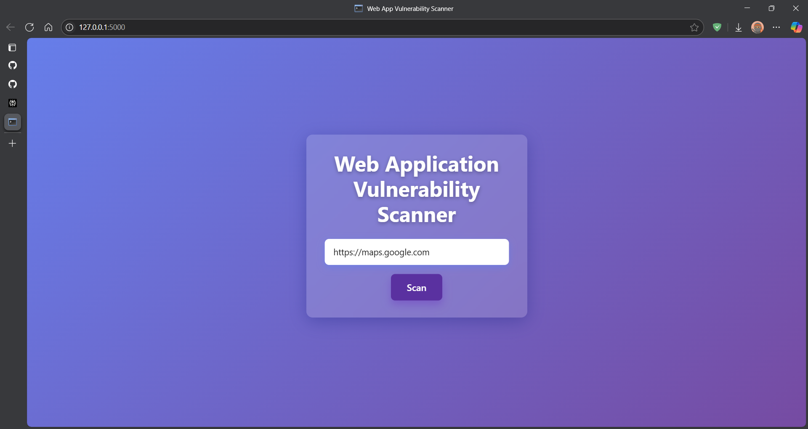
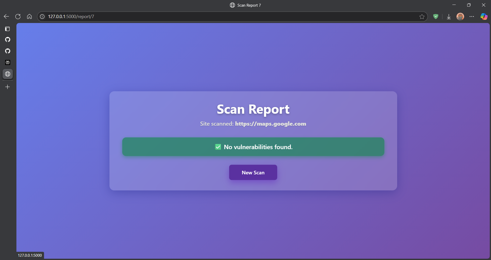

## Web Application Vulnerability Scanner

A Python-based web application vulnerability scanner that detects common vulnerabilities in Web Applications like — XSS, SQL Injection, and CSRF issues — with a modern Flask web interface.

---

### Features

- **Automated website crawling** using requests and BeautifulSoup.
- **Active vulnerability testing** (XSS, SQL Injection, CSRF token checks) for forms on each page.
- **Modern, responsive web UI** (Bootstrap 5 + custom CSS).
- **Scan history saved to disk** (JSON) for persistent reports.
- **Severity-level reporting** for all discovered vulnerabilities.

---

### Screenshots


---

### Getting Started

#### Installation

1. **Clone this repository**

    ```
    git clone https://github.com/PavanKumarCCB-001/WebAppScanner.git
    cd WebAppScanner
    ```

2. **Install dependencies**

    ```
    pip install -r requirements.txt
    ```

    *Required packages*: Flask, requests, beautifulsoup4

3. **Run the app**

    ```
    python app.py
    ```

4. **Access the web interface**

    Open your browser and go to: [http://127.0.0.1:5000](http://127.0.0.1:5000)

---

### Usage

1. Enter a target website URL (with `http://` or `https://`).
2. Start a scan.
3. View discovered vulnerabilities and scan history in attractive, organized reports.
4. Click on “New Scan” to scan a different site.

---

#### Customization

- **Change scan depth:** Adjust `max_depth` when creating the `WebSecurityScanner` in `scanner.py` to control how many pages deep the crawler goes.
- **Performance:** For large websites, consider lowering the crawl depth or add a maximum page limit.
- **Payloads:** Edit or extend the XSS/SQLi payloads in `scanner.py` for more advanced detection.
- **Persistent scan history:** Results are saved to `scan_history.json` and loaded on startup.

---

## Project Structure
